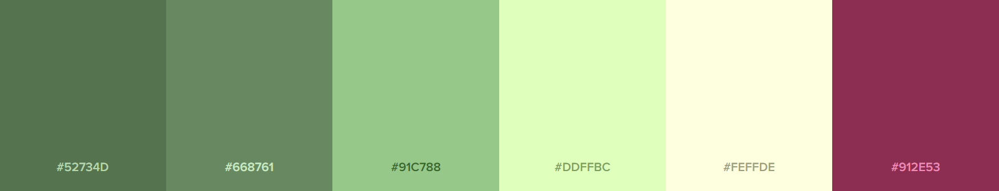

# **Tippy** - Tea Subscription

<p align="center">
    
</p>

[Tippy - live site](https://tippy-tea-subscription.herokuapp.com/)

<p align="center">
    
</p>

_*This site is for training purposes only, the company is fictional and no orders will be charged or products received.* _

## **About Tippy**

Tippy is a specialist subscription service bringing the greatest tastes from the world of teas to your door. Our experts work with a vast network of growers from around the world to source the best for you each and every month. Whether you're looking to discover something new or simply want the best from your morning cup, explore more of what you love with Tippy.

## **Table of contents**

- [**Tippy** - Tea Subscription](#tippy---tea-subscription)
  - [**About Tippy**](#about-tippy)
  - [**Table of contents**](#table-of-contents)
  - [**UX Design**](#ux-design)
    - [Project Goals](#project-goals)
    - [User Stories](#user-stories)
      - [As a first time user/potential customer -](#as-a-first-time-userpotential-customer--)
      - [As a return user/customer -](#as-a-return-usercustomer--)
      - [As an admin user -](#as-an-admin-user--)
    - [Wireframes](#wireframes)
    - [Design](#design)
  - [Database schema](#database-schema)
  - [Features](#features)
    - [Navigation](#navigation)
    - [Footer](#footer)
    - [Messages - toasts](#messages---toasts)
    - [Home](#home)
    - [Subscriptions](#subscriptions)
    - [About Us](#about-us)
    - [Blog](#blog)
    - [Profile](#profile)
    - [Mailing](#mailing)
    - [Auth](#auth)
      - [Log In](#log-in)
      - [Sign Out](#sign-out)
      - [Register](#register)
    - [Error Pages](#error-pages)
  - [Testing](#testing)
  - [Deployment](#deployment)
    - [Deploying to Heroku](#deploying-to-heroku)
    - [Configuring Stripe](#configuring-stripe)
    - [Configuring Gmail](#configuring-gmail)
    - [Configuring AWS S3](#configuring-aws-s3)
  - [Credits](#credits)
    - [Services](#services)
    - [Media](#media)
    - [Help and Info](#help-and-info)

## **UX Design**

### Project Goals

The goal of this project is to produce an e-commerce website selling monthly specialist tea subscriptions to users. The site will allow users to find information on all services and make/manage their purchases.

### User Stories

#### As a first time user/potential customer -

- Easily understand the site's purpose and learn more about the services offered.
- Easily navigate to all relevant pages.
- Easily find product details and prices to allow me to make an informed decision.
- Create an account to store personal and purchase information.
- Purchase a subscription.
- Sign up for the company newsletter.

#### As a return user/customer -

- Login to my account.
- View and adjust purchase information and maintain user information such as delivery address and payment info.
- View my subscription details.
- Cancel/amend my current subscription.
- Easily find any relevant product/subscription updates.
- Sign up/cancel my subscription to the newsletter.

#### As an admin user -

- Log in to an admin account.
- Send emails to users signed up to the mailing list.
- Add posts to the site's info blog.

For user stories checklist please view the google sheets table [here](https://docs.google.com/spreadsheets/d/1rKYF5s_qeeRhiHWJwbDJQ15gvJIOe2B4bTUiPIVZyoo/edit?usp=sharing).

### Wireframes

Wireframes were created for mobile, tablet and desktop screen sizes with [Figma](https://www.figma.com).

- [Mobile](readme-assets/tippy-wireframes-mobile.png)
- [Tablet](readme-assets/tippy-wireframes-tablet.png)
- [Desktop](readme-assets/tippy-wireframes-desktop.png)

### Design

As tippy is targeted as a specialist and high end service I wanted the site to reflect this with a clean and clear design. I chose to use a fairly soft palette in shades of green to tie in to the product and give a somewhat premium feel. Included a dark raspberry accent/action colour to compliment.

<p align="center">
    
</p>

The site uses django-allauth pages for user management. All of these pages have been styled to match the rest of the website.

## Database schema

Database model created using [dbdiagram.io](https://dbdiagram.io)

<p align="center">
    
</p>

The site uses five models as shown above:

- User (profile) extends the django user model and stores all required user data.
- Subscriptions: represents the plans a user can subscribe to and is extracted from products on stripe using djstripe.
- Orders: links user by id to the product they have ordered.
- Mailing: holds the email addresses of all people signed up to the mailing list.
- Blogs: are created by admin users and displayed to the user on the blogs page.

## Features

### Navigation

The site's navigation section is located at the top of all pages. This section contains page navigation controls and is adaptive to screen size and whether the current user is logged in. The navigation elements will also highlight depending on the current page.

<p align="center">
    
</p>
<p align="center">
    
</p>
For smaller screen sizes the navbar is collapsible and is accessed by a burger icon in the top left of the screen.
<p align="center">
    
</p>
<p align="center">
    
</p>

1. When logged in the page links are as follows: Subscriptions - About Us - Blog - Profile - Log Out.
2. When logged out the page links are as follows: Subscriptions - About Us - Blog - Register - Log In.

### Footer

The footer is located at the bottom of all pages and contains links to social media pages, sign up page for newsletter/mailing list and a message informing the user that this site is fictional.

<p align="center">
    
</p>

### Messages - toasts

This site uses djangos messages framework to provide users with helpful feedback at multiple points through their journey in the form of toasts.

<p align="center">
    
</p>

### Home

The homepage consists of two main sections; the first contains a small description of what tippy is and its service, it also contains a prominent call to action button which will take the user to the subscriptions page. at the bottom of this section is a chevron button which when clicked, scrolls the page to the next section.

<p align="center">
    
</p>

The 'How It Works' section contains three cards detailing the journey a customer will go through in order to start a subscription as well as some more details about the service.

<p align="center">
    
</p>

### Subscriptions

The subscription page contains cards for each plan that can be subscribed to detailing: name, image, description and price for each as well as a button which will take the user to the checkout page to complete the purchase of that subscription.

<p align="center">
    
</p>

### About Us

The about us page is for users who want to learn a little more about the company. It contains two cards each containing details on the company's ideals and philosophies as well as the work they are doing.

<p align="center">
    
</p>

### Blog

The blog page contains blog post updates created by admins. Each post contains a title, image, body text and the author.

<p align="center">
    
</p>

When logged in as an admin this page has additional features. There is a button at the top of the page which will take the user to a form to create a new post, as well as edit and delete controls for each existing blog. The delete button will bring up a box to confirm/cancel the deletion. Selecting confirm will remove the blog post from the database.

<p align="center">
    
</p>

The add new blog page contains a form with fields for all required blog information. Selecting add will add this information to the database, cancel will return the user to the blogs page.

<p align="center">
    
</p>

The edit blogs page uses the same form as the add blogs page but is pre-filled with the information from the blog that was selected to edit. Selecting confirm will update that blog's info in the database, the cancel button will return you to the blogs page.

<p align="center">
    
</p>

### Profile

The profile page contains a form detailing a users stored info and a checkbox reflecting the users current subscription to mailing list status. If the user has saved data previously these will be pre filled, if they are already signed up for the mailing list the checkbox will be checked. The profile page also contains controls to manage subscriptions by opening the stripe customer portal and controls to delete user account. When logged in as an admin there will also be an additional control to navigate to the send newsletter page.

<p align="center">
    
</p>

### Mailing

The subscribe to mailing page contains a form with a single field for the user's email. If the user is logged in and already has an email address associated with their profile this field will be pre filled. Filling in the field and selecting register will add that address to the mailing list. If the entered email address is already part of the mailing list the user will receive a toast message to inform them of this and no action will be taken.

<p align="center">
    
</p>

The unsubscribe from mailing list page uses the same form from the subscribe page and is also pre filled if the user is logged in and has a registered email address. Filling in the field and selecting submit will remove that address from the mailing list if it is present. If the entered email address is not present in the mailing list the user will receive a toast message to inform them of this and no action will be taken.

<p align="center">
    
</p>

When admin users are logged in they can access the send newsletter page from their profile page. This page consists of a form with fields for subject and message. Filling in these fields and selecting 'Send' will send an email with these details to each email address in the mailing list.

<p align="center">
    
</p>

### Auth

Auth is handled by django-allauth but all pages have been edited and restyled to match the rest of the website.

#### Log In

The sign in page contains a form which the user can use to log in if they have already registered for an account. Simply enter their details and select sign in. Selecting the forgot password button will direct the user to the password reset page. If they do not have an account there is a link to direct them to register for one.

<p align="center">
    
</p>

#### Sign Out

The sign out page asks the user to confirm they wish to sign out. Clicking the sign out button will log the user out and redirect them to the homepage.

<p align="center">
    
</p>

#### Register

The register page contains a form the user can use to create an account. They must enter all relevant details before clicking the sign up button and confirming their email address before logging in.

<p align="center">
    
</p>

### Error Pages

Custom error pages for 404 and 500 errors contain a simple box showing the error type and a button to return to the site homepage.

<p align="center">
    
</p>

## Testing

For full testing documentation please see [TESTING.md](TESTING.md)

## Deployment

### Deploying to Heroku

To deploy this application to heroku first I made sure to establish a requirements.txt and Procfile as heroku needs these to operate. First into the terminal to establish the requirements.txt file enter:

```sh
pip3 freeze --local > requirements.txt
```

Then to create the Procfile:

```sh
echo web: gunicorn tippy.wsgi:application > Procfile
```

- Navigated to [Heroku](https://www.heroku.com/).
- Navigate to the dashboard and select 'New' - 'Create new app'
- Enter a unique application name and select region then click 'Create app'
- Navigate to the new apps overview page, under installed add-ons click 'configure Add-ons'. Search for 'Heroku Postgres' and select to add it to add-ons.
- To set up automatic deployment I selected 'GitHub' under the 'Deployment method' section. Then selected my github profile and the name of the repository containing my code.
- I then added my config variables to Heroku by navigating to settings, scrolling down and clicking 'Reveal Config Vars'. Then entering the key value pairs.
- I then returned to the deploy tab and selected 'Enable Automatic deployment'.
- Once the app is deployed the live site can be accessed by selecting the 'Open app' button at the top right of the page.

### Configuring Stripe

- Login to stripe
- Select the 'new business' button at the top left of the screen and enter the name.
- Navigate to the products tab and add products using the add product button.
- Navigate to the 'developers' tab in the top right then 'webhooks' in the left navigation menu.
- Select 'Add an endpoint'
- Enter the endpoint url (https://tippy-tea-subscription.herokuapp.com/checkout/webhook/)
- Click 'select events' then select all events and 'Add events'.
- Select Add endpoint.
- Navigate to settings, then email under business settings.
- Turn on, 'email customers about successful payments'.
- Entered config vars to heroku for the stripe public, secret and webhook keys.
- The public and secret keys are located in the upper right section of the developers tab.
- The webhook secret is located in the business endpoint of the webhooks section of the developer tab, under signing secret.

### Configuring Gmail

- Log in to gmail.
- Navigate to settings, then select accounts and Import > other google account settings > Security > Signing into google.
- Click to turn on 2 step verification and follow instructions to verify.
- Return to the security page and select the new option 'App passwords' under signing into google.
- For app select 'Mail' and under select device select other and type 'django'.
- Copy the generated app password and save it as a config variable in heroku along with the gmail email account.
  ```
  EMAIL_HOST_PASS: generatedAppPassword
  EMAIL_HOST_USER: example@gmail.com
  ```

### Configuring AWS S3

- For the AWS deployment configuration the project reduced scope of static file hosting by comparison to the 'boutique ado Code Institute' tutorial project and so I was able to follow the same steps omitting media file configuration.
- After configuration I retrieved the AWS_ACCESS_KEY_ID and AWS_SECRET_ACCESS_KEY keys via the text download and inserted them into my heroku config vars.

## Credits

### Services

- [Materialize](https://materializecss.com/) - layout, interactive components, element styling, text colours and icons.
- [Google fonts](https://fonts.google.com/).
- [Font Awesome](https://fontawesome.com/) - general additional icons.
- [Django](https://www.djangoproject.com/) python framework.
- [Stripe documentation](https://stripe.com/docs/billing/quickstart) - checkout app was adapted from code found in the stripe docs billing quick start guid.
- [djstripe](https://dj-stripe.dev/) linking between django and stripe.
- [Heroku](https://www.heroku.com/) application host.
- [Amazon S3](https://aws.amazon.com) - cloud storage.
- [Gunicorn](https://gunicorn.org/) - wsgi server.
- [MySQL](https://www.sqlite.org/index.html) - database.

### Media

- [Cloudinary](https://cloudinary.com/console/c-087b7b36d5737750ed37ab5fb60479/getting-started) CDN was used for cloud based image storage and servicing.
- Images were sourced from [Pexels](https://www.pexels.com/) and can be found in [this collection](https://www.pexels.com/collections/tippy-w5mdqpg/).
- The brand logo and favicon were created my me using [Adobe Ilistrator](https://www.adobe.com/uk/products/illustrator.html).
- All body copy was written by me.

### Help and Info

- Code Institute learning material - general knowledge.
- Code Institute - 'boutique ado' learning project - specific django knowledge and some settings configuration.
- [Stripe documentation](https://stripe.com/docs/billing/quickstart) - checkout app was adapted from code found in the stripe docs billing quick start guide.
- [djstripe docs](https://dj-stripe.dev/) linking between django and stripe.
- [Codecademy](https://www.codecademy.com/learn) - general knowledge.
- [w3schools](https://www.w3schools.com/) - general knowledge.
- [MND Web Docs](https://developer.mozilla.org/en-US/) - general knowledge.
- [Stack Overflow](https://stackoverflow.com/) - debugging.
- [Django documentation](https://docs.djangoproject.com/en/4.0/)
- [dbdiagram.io](https://dbdiagram.io) used to create database diagram.
- [Youtube tutorial](https://www.youtube.com/watch?v=GBgRMdjAx_c) from [Very Academy](https://www.youtube.com/c/veryacademy) on youtube on testing in django.
- [Github Gist - tommorris](https://gist.github.com/tommorris/cd1048418cccfa346fef) - Create and login as super user in tests.
