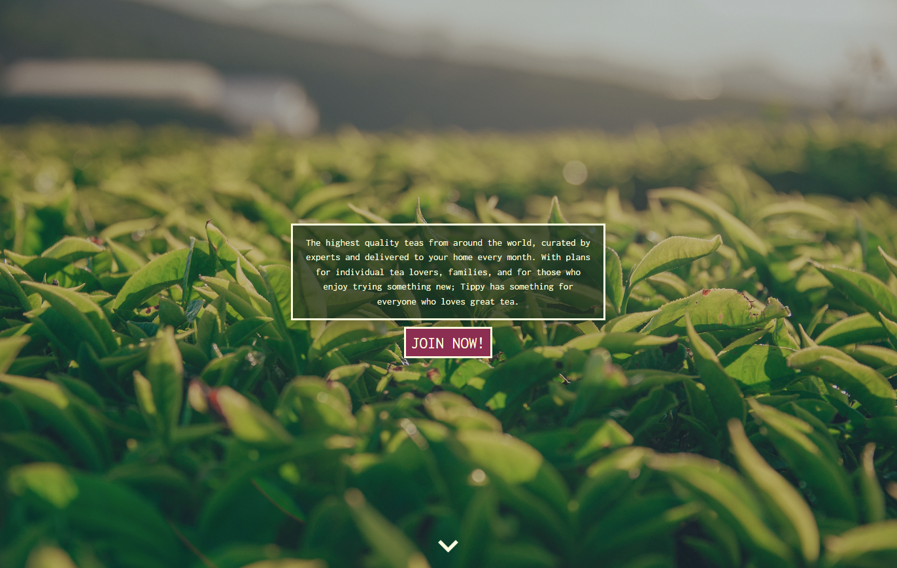
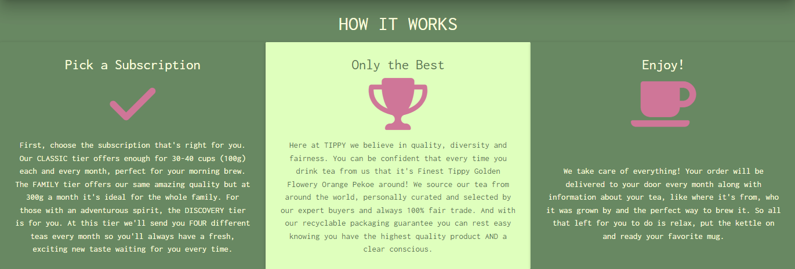
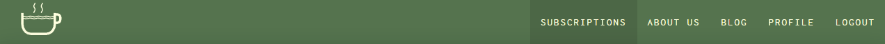
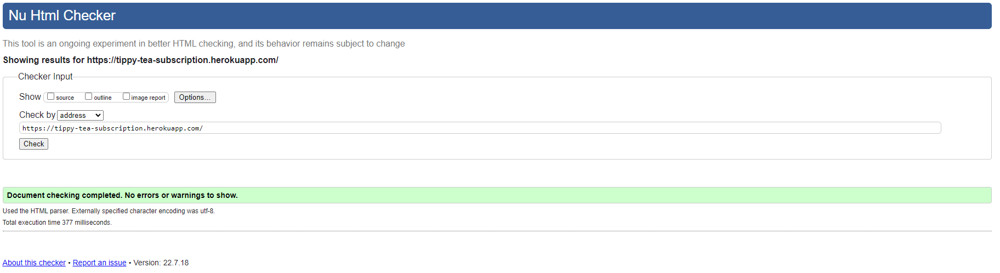
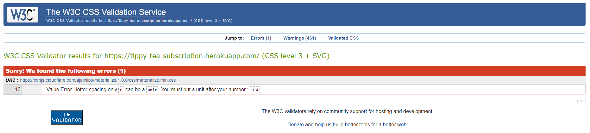
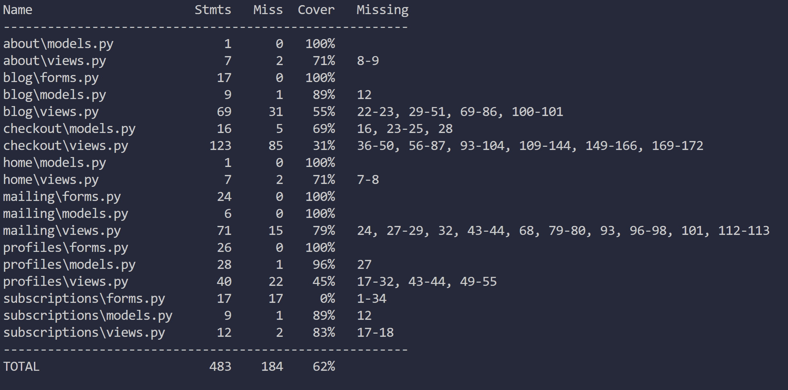

# **Tippy** - Testing

<p align="center">
    
</p>

[README.md](README.md)

## **Table of contents**

- [**Tippy** - Testing](#tippy---testing)
  - [**Table of contents**](#table-of-contents)
  - [**User stories testing**](#user-stories-testing)
      - [As a first time user/potential customer -](#as-a-first-time-userpotential-customer--)
      - [As a return user/customer -](#as-a-return-usercustomer--)
      - [As an admin user -](#as-an-admin-user--)
  - [**Manual testing**](#manual-testing)
  - [**Responsive Design**](#responsive-design)
  - [Code Validation](#code-validation)
    - [HTML validation](#html-validation)
    - [CSS validation](#css-validation)
    - [JS validation](#js-validation)
    - [Python validation](#python-validation)
  - [Automated Test Suite (unit tests)](#automated-test-suite-unit-tests)
    - [Cloning and installing the repository](#cloning-and-installing-the-repository)
      - [Prerequisites](#prerequisites)
      - [Download and Installation](#download-and-installation)
      - [Running the test suite](#running-the-test-suite)
  - [**Bugs**](#bugs)

## **User stories testing**

#### As a first time user/potential customer -

- Easily understand the site's purpose and learn more about the services offered.
  - The site's homepage background image and introduction paragraph quickly inform first time users of the site's purpose. This is then further expanded upon if the user scrolls to the 'How it Works' section of the homepage or visits the about us page.
  <p align="center">
    
  </p>
  <p align="center">
    
  </p>
- Easily navigate to all relevant pages.
  - The site boasts an elegant, intuitive and adaptive navigation system on all screen sizes. Making it simple to traverse all pages.
  <p align="center">
    
  </p>
  <p align="center">
  
  </p>
- Easily find product details and prices to allow me to make an informed decision.
  - The subscriptions page can be accessed from the navbar on any page or from the 'call to action' on the homepage. This page details all product info and pricing.
  <p align="center">
    
  </p>
- Create an account to store personal and purchase information.
  - Once a user has been created they can navigate to the profile page. Here a user can manage their details such as delivery info and subscription to mailing list status. If they have already made any purchases they will also be able to view and edit them here.
  <p align="center">
  
  </p>
- Purchase a subscription.
  - Selecting a plan from the subscriptions page will direct the user to the checkout page (if they are logged in, login page if not) and allow them to enter their details and purchase a subscription.
  <p align="center">
  
  </p>
- Sign up for the company newsletter.
  - If a user wants to stay up to date with tippy they can sign up to the mailing list from the link in the footer of all pages. By simply adding their email they will receive all updates. This does not require the user to have an account. Registered users can also sign up from the mailing list checkbox on their profile page.
  <p align="center">
  
  </p>

#### As a return user/customer -

- Login to my account.
  - Users can navigate to the login page from the navbar on any page. Entering their details here will log them in.
  <p align="center">
  
  </p>
- View and adjust purchase information and maintain user information such as delivery address and payment info.
- View my subscription details.
  - Users have access to all saved profile information on their profile page. Here they can manage this information by simply updating the form and clicking the update button. If the user has any active subscriptions this purchase/subscription information can be accessed by selecting the manage subscriptions button.
  <p align="center">
  
  </p>
- Cancel/amend my current subscription.
  - If the user has any active subscriptions they can be cancelled from the manage subscriptions button on the profile page.
- Easily find any relevant product/subscription updates.
  - All updates will be sent to users via the mailing list but also posted as blog posts for those who do not wish to sign up.
  <p align="center">
  
  </p>
- Sign up/cancel my subscription to the newsletter.
  - Subscription to the mailing list can be added/cancelled at any time from the profile page for registered users by checking/unchecking the 'Register for mailing list' checkbox on the profile form and clicking 'update information'. Alternatively this can be done from the 'Register for newsletter'/'Unsubscribe from newsletter' pages by entering the registered email and clicking submit.
  <p align="center">
  
  </p>
  <p align="center">
  
  </p>

#### As an admin user -

- Log in to an admin account.
  - Admin users can navigate to the login page from the navbar on any page. Entering their admin credentials here will log them in.
  <p align="center">
  
  </p>
- Send emails to users signed up to the mailing list.
  - Admin users have access to the 'Send newsletter' button on their profile page. Clicking this will take them to the send newsletter page where they can enter details and send emails to all addresses on the mailing list.
  <p align="center">
  
  </p>
- Add posts to the site's info blog.
  - When logged in as an admin user, users can access the 'Add new post' button at the top of the blogs page. This button navigates to the 'add blog post' page where the superuser can enter details and add new blogs to the database for users to view.
  <p align="center">
  
  </p> 
  <p align="center">
  
  </p>

## **Manual testing**

To fully test my application in both the development and production environments I devised a series of manual tests to assure all aspects of the site work as intended. By completing these tests in the development and production environments concurrently I can also easily identify any differences between the two.

1. Navbar - all pages (desktop)

- Check navigation links are displayed as expected and lead to the intended pages when selected.
  - Logged out: Subscriptions, About Us, Blog, Register, Log In.
  - Logged In: Subscriptions, About Us, Blog, Profile, Log Out.
- Current page is highlighted in navbar with active styling.
- Brand logo directs the user to the homepage when clicked.

2. Navbar - all pages (mobile)

- Sidenav opens when the burger icon is clicked.
- Check navigation links are displayed as expected and lead to the intended pages when selected.
  - Logged out: Subscriptions, About Us, Blog, Register, Log In.
  - Logged In: Subscriptions, About Us, Blog, Profile, Log Out.
- Current page is highlighted in navbar with active styling.
- Brand name directs the user to the homepage when clicked.

3. Footer - all pages

- Check footer is displayed at the bottom of the page and contains the social media link icons for facebook, instagram and twitter, link to newsletter sign up and warning to customers of this being a fictional site.
- Footer social media links open on new pages to the expected destination pages.

4. Home page (/)

- Check expected sections are displayed with correct information.
- Link in main section navigates to the subscriptions page.
- Chevron moves the user's view to the 'How it works' section.

5. Subscriptions (/subscriptions)

- All subscription cards have been rendered as expected.
- Each card contain the correct information (name, image, description, price)
- Each card contains a select button which takes the user to checkout with the correct info when clicked.

6. About us (/about)

- All relevant page items load correctly (two cards with an image and a block of text each).

7. Blog (/blog)

- Logged out / non admin user
  - No 'add new post' button rendered
  - All blog posts rendered as expected including all info (name, image, body, author)
- Logged in as admin
  - All blog posts rendered as expected including all info (name, image, body, author)
  - Each blog post contains controls to edit and delete the post.
  - Delete button brings up confirmation dropdown, and will remove post if confirmed.
  - Edit button takes user to edit blog page.
  - Add new post button renders at top of page. Clicking this takes the user to the add new blog page.

8. Blog (/blog/add/)

- If accessed by non admin users they are redirected to the login page.
- Page renders a blog form with fields for title, author, content, and imageUrl as well as cancel and add buttons.
- Selecting cancel returns the user to the blogs page.
- Form will only submit if valid data has been entered.
- Selecting add will add the new blog post to the database and return the user to the blogs page and render the new post.

1.  Blog (/blog/edit/\<id>)

- If accessed by non admin users they are redirected to the login page.
- Page renders a blog form with fields for title, author, content, and imageUrl as well as cancel and confirm buttons.
- All fields are filled in and the data is correct as to the post the user has come from.
- Selecting cancel returns the user to the blogs page.
- Form will only submit if valid data has been entered.
- Selecting confirm will update the blog post in the database, return the user to the blogs page and render the new post.

1.  Profile (/profile/)

- If accessed by a non user they are redirected to the login page.
- Page renders a profile form with fields for name, email, phone number, street address line 1 and 2, town, city, postcode, country and a checkbox for mailing list as well as buttons to update profile, and delete account. If the user has current subscriptions then a manage subscriptions button also renders.
- If the user has registered for the mailing list the mailing list checkbox starts checked.
- If the user already has saved profile information these fields are filled in and correct.
- Altering/entering data and selecting the update information button, updates the profile in the database and reloads the page displaying the new data.
- If the user selects the delete account button it brings up a confirmation dropdown, and will remove the user if confirmed. The user account will then be removed from the database and the user logged out.
- If the user selects the manage subscriptions button they are redirected to the stripe customer portal via the checkout/create-portal-session page.
- If the user is admin then an addition send newsletter button renders. This button directs the user to the send newsletter page.

1.  Send Newsletter (/mailing/send-newsletter)

- If accessed by a non admin user they are redirected to the login page.
- Page renders a mailing form containing fields for subject and message.
- Page also renders a send button. The mail form will only submit with valid data.
- Filling in the fields and selecting the send button will send an email made from the submitted data to all emails on the mailing list.
- Reloads page on submit and shows toast response message for both successful and unsuccessful email submissions.
- Fields blank on reload to prevent resending the same email.

1.  Register for newsletter (/mailing/)

- Page renders a form containing an email input and a submit button.
- If the user enters a valid email and presses the submit button the entered email will be added to the mailing list database table.
- If the email is already in the mailing list it will not be added again and the user will receive a toast message informing them they are already subscribed.
- If the user is logged in and already has an email address registered to their profile it will pre populate the email field with this info.
- On successful form submission, reloads the page and presents a confirmation toast to the user.
- Renders a link to the 'unsubscribe from mailing list' page.

13. Unsubscribe from mailing list (/mailing/newsletter-unsubscribe)

- Page renders a form containing an email input and a submit button.
- If the user enters a valid email and presses the submit button the entered email will be removed from the mailing list database table.
- If the email is not already in the mailing list it will not be removed and the user will receive a toast message informing them they are not in the mailing list.
- If the user is logged in and already has an email address registered to their profile it will pre populate the email field with this info.
- On successful form submission, reloads the page and presents a confirmation toast to the user.

14. Login (/accounts/login/)

- If the user is logged in redirects user to the site homepage.
- Renders a link to the register page.
- Renders a form for users to enter username/e-mail and password and a sign in button.
- Entering invalid data prompts the user to check their input.
- Entering valid user data and selecting the sign in button will log the user in and redirect them to the home page.

15. Register (/accounts/register/)

- If the user is logged in they are redirected to the site homepage.
- Renders a link to the login page.
- Renders a form for users to enter username,email, email-confirmation, password, password-confirmation and a sign up button.
- Entering invalid data prompts the user to check their input.
- Entering valid user data and selecting the sign up button will register the user, adding them to the user database and directing them to the email confirmation page.

1.  Confirm Email (/accounts/confirm-email/)

- Renders a heading a paragraph prompting the user to verify their email via the email sent to their account during registration.

17. Confirm Email (/accounts/confirm-email/\<id>)

- Renders confirm email address and confirm button.
- Upon selecting confirm the user's email address is confirmed and the user is redirected to the login page.

18. Sign Out (/accounts/logout/)

- If the user is not logged in they are redirected to the homepage.
- Renders a sign out message and a sign out button.
- Upon selecting the sign out button the user is logged out and redirected to the homepage.

19. Checkout (/checkout/)

- If the user is not logged in or navigates to this page outside of the subscriptions page (creates a valid query param and makes a post request) they are redirected to the login/homepage.
- Renders the selected subscription information, a profile information form (same fields as profile page) and a checkout button.
- If the user fills out all required fields (all fields except street address 2 and mailing checkbox) and selects the checkout button they are redirected to the stripe portal via the checkout/create-checkout-session page.

20. Checkout (checkout/create-checkout-session/)

- If the profile entered is invalid or the user is not logged in or the user navigates to this page from outside of the /checkout page (not a post request with invalid form data) they are redirected to the login or homepage
- If valid profile data is entered the profile record associated with the user is updated and they are redirected to the stripe checkout portal.
- Upon successful checkout the user is redirected to the checkout/success page
- Upon cancellation the user is redirected to the checkout/cancel page.

21. Checkout Success (/checkout/success/)

- If the user is not logged in they are redirected to the login page.
- If the user navigates to this page manually (invalid session_id query param) they are redirected to the homepage.
- If the user is a new customer the stripe customer information is saved to the users profile record.
- Renders a confirmation message with subscription product information and a button which links to the customer subscription management portal.

1.  Checkout Cancel (/checkout/cancel/)

- Renders a confirmation message of successful cancellation.

23. Webhooks (/checkout/webhook/)

- If a user navigates to this page manually they will receive a 405 http error.
- This endpoint handles the webhooks from stripe. In the stripe webhooks dashboard the webhooks receive a 400 response.
- When the webhook type is for subscription creation an order is added to the orders table in the database with fields, user, product and order_number.
- On successful order creation an email is sent to the user confirming their order number and subscription details.
- When the webhook type is for subscription cancellation the related customer order is removed from the orders table in the database.
- The above two points reflect via the admin portal view of the orders table.

I have completed these checks for both the development and production environments and found all site elements, CRUD functionality and layout/styling work as intended.

## **Responsive Design**

To test the responsive design of my site I checked each page in various sizes using Google Chrome's Dev tools. Chrome dev tools allows you to virtually scale your site to a variety of common device types and also allows you to input specific, custom display dimensions to test any screen size. Using this tool I was able to render each page in a variety of screen sizes and check the results. For each resolution I checked for:

- Clearly legible text
- Consistent styling
- No blocked or hidden elements

Here are some screenshots demonstrating this for the site subscriptions page.

- Mobile (375-667px)
<p align="center">
    
</p>
- Tablet (768-1024px)
<p align="center">
    
</p>
- Desktop (1920-1080px)
<p align="center">
    
</p>

## Code Validation

### HTML validation

All HTML was tested using [Nu HTML Checker](https://validator.w3.org/nu/) and returned no errors.

<p align="center">
    
</p>

### CSS validation

All custom CSS code was tested using the [Jigsaw css validator](https://jigsaw.w3.org/css-validator/) and showed no errors relating to custom code. All errors were relating to the Materialize CDN CSS.

<p align="center">
    
</p>

### JS validation

All Javascript code was tested using [Beautify Tool Javascript validator](https://beautifytools.com/javascript-validator.php) and returned no errors.

### Python validation

All Python was tested and checked against pep8 standards using pylint in vscode and returned no errors.

## Automated Test Suite (unit tests)

### Cloning and installing the repository

In order to run the automated test suite you will have to clone the repository to your device.

#### Prerequisites

- python
- git
- pip/pipenv
- bash terminal
- stripe

#### Download and Installation

To clone the repository run the following command in terminal:

```sh
git clone https://github.com/ChronoLogic12/tippy-tea-subscription.git tippy-tea-clone
cd tippy-tea-clone
```

Create a virtual environment by running:

```sh
pipenv shell
```

Once the environment has finished creating run the following command to install the project dependencies:

```
pipenv install
```

#### Running the test suite

To run the test suite in terminal run the following command:

```sh
python manage.py test
```

To generate a coverage report in the terminal run the following command:

```sh
coverage run manage.py test
```

To view the coverage report in terminal run the following command:

```sh
coverage report
```

The coverage report results read as follows.

<p align="center">
    
</p>

## **Bugs**

- When using a materialize dropdown component to display a delete confirmation button for each blog post created on the all blogs page I noticed that the delete confirmation buttons for each post were all being created with the ID for the first blog post rendered. This meant that selecting any delete confirmation button would delete the first post rendered to the page rather than its related post. The reason for this was that the 'data-target' attribute and the matching dropdown 'id' were the same for each card meaning there was only ever one instance of the dropdown component created. To correct for this I appended the blog posts unique id value to the 'data-target' and 'id' attributes for the dropdown elements on each card so that a unique dropdown would be created for each blog post.

```html
<a class="right red-text dropdown-trigger" href="#" data-target="delete-confirmation{{blog.id}}">
	delete
</a>
<ul id="delete-confirmation{{blog.id}}" class="dropdown-content">
	<li><a class="red-text" href="">Confirm</a></li>
	<li><a class="grey-text" href="#!">Cancel</a></li>
</ul>
```

- The default setting for django's send_mass_mail function CC in all recipients which is an undesired behavior as it would breach GDPR. To resolve this I instead used the Send_mail function and looped through a list of all emails to send emails. This is more computationally intensive but has the desired result for this small scale business.
